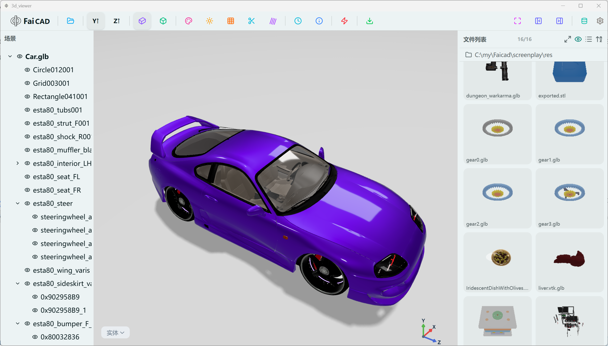
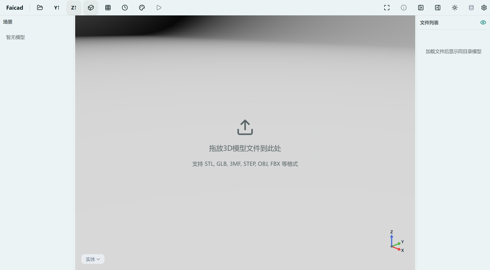
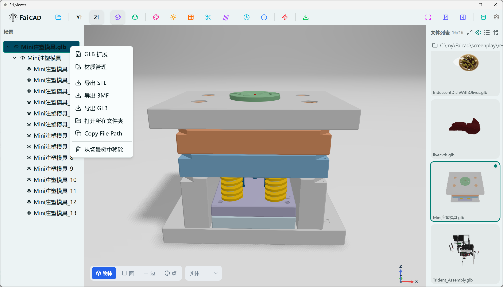
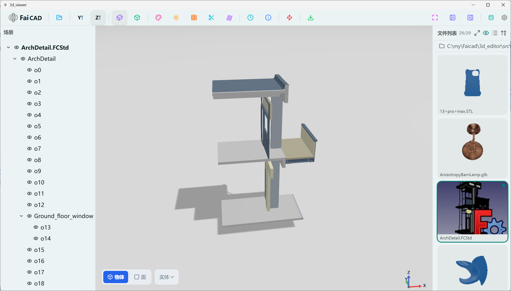

# 一个能快速预览多个本地3D文件的查看器，支持33+种格式，支持win/mac/linux

你有没有遇到过这种场景：

手里有十几个 STL 文件、几个 STEP 文件、还有几个 OBJ 模型，想快速看看哪个是自己要的那个。

于是你打开某个 3D 查看器，加载第一个文件。看完，关掉，再加载第二个。再关掉，再加载第三个……

**一次只能看一个文件。**

这不是某一个软件的问题，而是几乎所有 3D 查看器的通病。它们的设计假设是：用户一次只关心一个模型。

但现实工作流不是这样的。工程师需要在一堆模型里挑零件，设计师要在不同版本间对比，3D 打印爱好者想从几十个下载的文件里找合适的那个。

## Faicad 3D 查看器：多文件预览

Faicad 3D 查看器（Faicad 3D Viewer）是一个开源桌面应用，专门解决这个痛点。

它的核心设计思路很简单：**你打开一个 3D 文件，它自动帮你把同目录下所有支持的 3D 模型都列出来。**

### 怎么用

1. **拖入任意一个 3D 文件**到窗口
2. 右侧「文件列表」面板自动显示同目录下所有支持的模型
3. **点击列表中的文件**即可切换预览

就这么简单。

除了多文件预览，它还支持：

- **PBR 材质渲染** — 基于物理的渲染，金属感、粗糙度真实呈现
- **中英文界面 + 屏幕暗色/亮色自适应和切换**
- **一键导出** — 在文件名上点击右键，即可把任意 3D 格式导出为 STL / 3MF / GLB

### 右键文件名，一键导出

在文件列表里任意文件名上点击右键，就能把当前模型导出成你需要的格式。无论把 STEP 工程图转成 GLB 丢进网页、还是把任意模型统一成 STL/3MF 去 3D 打印，都很方便。

## 支持 33 种 3D 文件格式

这是 Faicad 最硬核的地方。大多数 3D 查看器支持 10-20 种格式就不错了，Faicad 支持整整 **33 种 3D 格式**，外加 4 种辅助实用格式。

### 网格类（Mesh）— 14 种

最常用的 3D 模型格式全覆盖：

| 格式 | 说明 |
|------|------|
| STL | 3D 打印最常用格式，支持 ASCII 和二进制 |
| GLB | glTF 2.0 二进制，Web 3D 标准格式 |
| GLTF | glTF 2.0 JSON，自动解析外部纹理引用 |
| 3MF | 3D Manufacturing Format，微软主导 |
| OBJ | Wavefront OBJ，通用交换格式 |
| PLY | Stanford 三角形格式，支持 ASCII 和二进制 |
| FBX | Autodesk Filmbox，游戏/动画行业主流 |
| DAE | Collada，基于 XML 的开放标准 |
| 3DS | 3D Studio 旧版格式，兼容老资源 |
| USDZ | Apple AR 格式，iOS/macOS 原生支持 |
| DRC | Draco 压缩网格，Google 开源压缩格式 |
| AMF | Additive Manufacturing Format，支持颜色和材质 |
| LWO | LightWave 3D 对象格式 |
| 3DM | Rhinoceros（犀牛）原生格式 |

### CAD 工程格式 — 6 种

工程领域的高精度格式，通过 OCCT 引擎转换渲染：

| 格式 | 说明 |
|------|------|
| STEP | 国际标准 CAD 交换格式，精度无损 |
| STPZ | ZIP 压缩的 STEP 文件 |
| IGES | 初始图形交换规范，早期 CAD 标准 |
| BREP | OpenCASCADE 边界表示格式 |
| FreeCAD | FreeCAD 原生项目格式 |
| OpenSCAD | OpenSCAD 参数化脚本 |

### 其他专业格式 — 13 种

覆盖 BIM、动画、点云、体数据等垂直领域：

| 类别 | 格式 | 说明 |
|------|------|------|
| BIM | IFC | 工业基础类建筑信息模型 |
| 动画 | BVH | 骨骼动画骨架格式 |
| 动画 | MD2 | Quake II 游戏模型 |
| 点云 | XYZ | 纯坐标点云数据 |
| 点云 | PDB | 蛋白质数据库分子结构 |
| 点云 | PCD | Point Cloud Data (PCL) |
| 体数据 | VTK | Visualization Toolkit |
| 体数据 | NRRD | 医学影像近原始数据 |
| GCode | GCode | 3D 打印刀具路径可视化 |
| VRML | WRL | 虚拟现实建模语言 |
| 体素 | VOX | MagicaVoxel 体素艺术 |
| 地理 | KMZ | Google Earth 3D 地理数据 |
| 3MF | Model | 3MF 包内嵌模型 |

### 辅助实用格式 — 4 种

非 3D 模型，但在工作流中有实际用途：

| 格式 | 用途 |
|------|------|
| SVG | 矢量图形叠加到 3D 视口 |
| DXF | AutoCAD 2D 图纸转为 SVG 叠加 |
| HDR | 高动态范围环境光照贴图 |
| EXR | OpenEXR 高质量环境贴图 |

## 为什么值得试试

**第一，真的免费开源。** 基于 Electron + Three.js 构建，代码完全开源，不需要注册账号，不需要付费解锁功能。

**第二，不需要安装一堆软件。** 一个应用搞定 37 种格式。以前你可能需要 MeshLab 看 PLY、FreeCAD 看 STEP、Blender 看 FBX——现在一个 Faicad 全部搞定。

**第三，本地运行，隐私安全。** 所有渲染都在本地完成，不需要上传文件到任何云端服务器。你的设计图纸不会离开你的电脑。

**第四，跨平台支持。** 主要开发平台是 Windows 10/11，同时适配了 Linux x64 和 macOS（Apple Silicon + Intel）。

## 怎么获取

- **官网下载**：https://faicad.cn
- **环境要求**：Windows 10/11（推荐），或 Linux / macOS

如果你经常和 3D 文件打交道，不管是做机械设计、3D 打印、游戏美术还是建筑 BIM，都值得试一试。

毕竟，**能一次看完所有模型的查看器，确实不多。**
